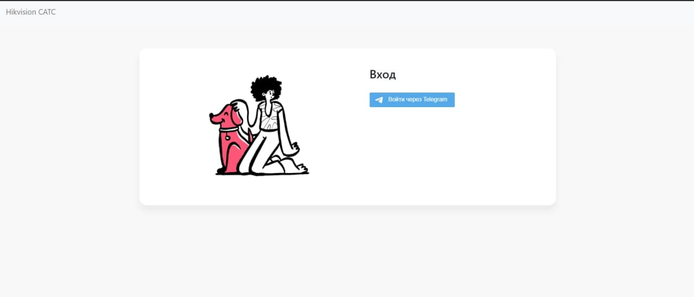

# hikvision_platform
Платформа для сброса пароля для устройств Hikvision



#### Создаем телеграм бота при помощи @botfaher

#### Создаем файл конфигурации
```commandline
touch .env
```

#### Вносим туда следузий шаблон и изменяем его 
```yaml
DEBUG=0
SECRET_KEY=''
ALLOWED_HOSTS=localhost 127.0.0.1 
TELEGRAM_BOT_NAME='telegrambotname'
TELEGRAM_BOT_TOKEN='123456:ABC-DEF1234ghIkl-zyx57W2v1u123ew11'
TELEGRAM_ADMIN_LIST=12345678 87654321
```

#### Заходим в @botfather выбираете бота и добавляете ему домен для авторизации

#### Собираем и разворачиваем проект
```commandline
docker-compose build
docker compose up -d
```

#### Делаем миграциии баззы данных
````commandline
docker-compose -f docker-compose.yml exec python manage.py makemigrations
docker-compose -f docker-compose.yml exec python manage.py migrate
````

#### Собираем статику для Nginx
```commandline
docker-compose -f docker-compose.yml exec python mangage.py collecstatic    
```

### Профит!